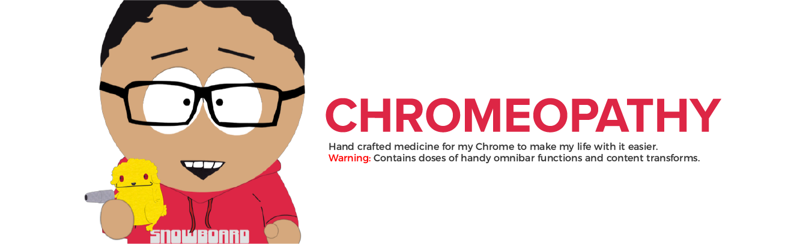
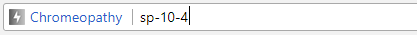

# Chromeopathy
Chrome extension that includes custom omnibar and content functions to make my life with chrome easier.



## Omnibar functions
Type <kbd>f</kbd> in the omnibar and then type any of the following keywords for the desired result.

> **Example:** The following input plays the 4th episode pf South Park's 10th season, buddy!



| Keyword | Function |
| ------ | ------ |
| **gm-{N}** | Open inbox for the **N**th profile |
| **sp / sp-r** | Plays a random South park episode |
| **sp-r-{season}** | Plays a random South park episode from the specified season |
| **sp-{season}** | Lists all South park episodes in the specified season |
| **sp-{season}-{episode}** | Plays the specified South park episode |
| **tr-{search-term}** | Lists search results on torrentz2.eu |
| **ak** | Plays a random [Akkara kazchakal](http://sahajr.xyz/3wvCb "Akkara kazchakal Wikipedia page") episode |

## Tools
These are some handy tools available on the popup.
* **Shorten URLs -** Get a short URL for the current URL for easier sharing.
* **Generate QR code for selected text/URL -** QR code sharing is faster than copy/paste when I need to transfer content/URLs from my PC to phone.
* **Generate QR code for short URL -** Generates a short URL for the current tab's URL and makes it easier for me to copy and share them anywhere via a QR code.
* **Shortcuts -** To frequently used links, and chrome specific ones like *extensions*.

## License
```
The MIT License (MIT)

Copyright © 2017 SahajR

Permission is hereby granted, free of charge, to any person
obtaining a copy of this software and associated documentation
files (the “Software”), to deal in the Software without
restriction, including without limitation the rights to use,
copy, modify, merge, publish, distribute, sublicense, and/or sell
copies of the Software, and to permit persons to whom the
Software is furnished to do so, subject to the following
conditions:

The above copyright notice and this permission notice shall be
included in all copies or substantial portions of the Software.

THE SOFTWARE IS PROVIDED “AS IS”, WITHOUT WARRANTY OF ANY KIND,
EXPRESS OR IMPLIED, INCLUDING BUT NOT LIMITED TO THE WARRANTIES
OF MERCHANTABILITY, FITNESS FOR A PARTICULAR PURPOSE AND
NONINFRINGEMENT. IN NO EVENT SHALL THE AUTHORS OR COPYRIGHT
HOLDERS BE LIABLE FOR ANY CLAIM, DAMAGES OR OTHER LIABILITY,
WHETHER IN AN ACTION OF CONTRACT, TORT OR OTHERWISE, ARISING
FROM, OUT OF OR IN CONNECTION WITH THE SOFTWARE OR THE USE OR
OTHER DEALINGS IN THE SOFTWARE.
```
